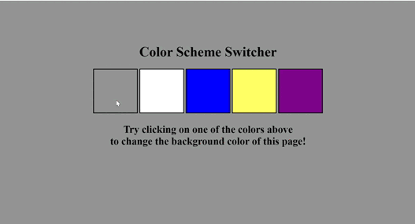

# Background Color Change using Js.

## Example 

1. You can fork the repo and make changes according to your's and test the results.
2. In this example I have used simple querySelector and click event to handle and control the behaviour of each buttons.